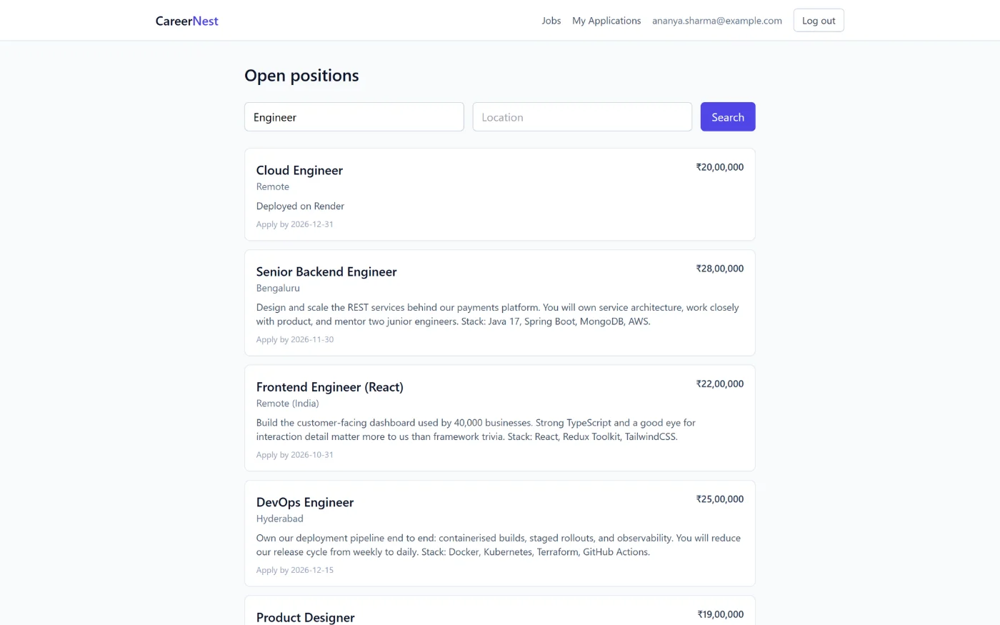
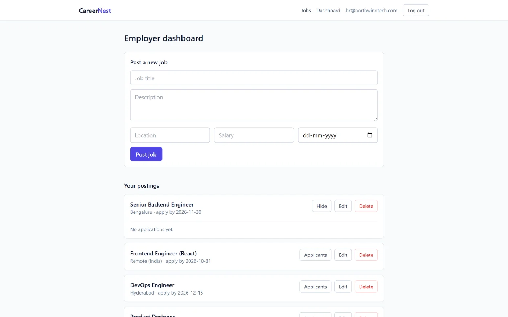
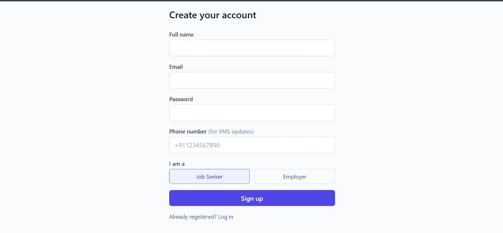

# CareerNest — Job Portal with SMS Notifications

A two-sided job portal: seekers browse and apply, employers post roles and manage
applicants, and candidates get a **real-time SMS** when their application status
changes. **Spring Boot 3.3.2** on **Java 17**, persisted in **MongoDB Atlas**, with a
**React (Vite)** frontend.

[**Live demo**](https://careernest-rho.vercel.app/) &nbsp;·&nbsp; Backend on Render, frontend on Vercel



---

## Contents

- [Tech stack](#tech-stack)
- [Architecture](#architecture)
- [Data model](#data-model)
- [API reference](#api-reference)
- [Getting started](#getting-started)
- [Configuration](#configuration)
- [Testing](#testing)
- [Deployment](#deployment)
- [Screenshots](#screenshots)

---

## Tech stack

| Layer | Technology |
|---|---|
| Language | Java 17 |
| Framework | Spring Boot 3.3.2 |
| Security | Spring Security + JWT (`jjwt`), BCrypt |
| Persistence | **Spring Data MongoDB** |
| Database | MongoDB Atlas |
| Messaging | Twilio Java SDK 12.1.1 — SMS and WhatsApp |
| Monitoring | Spring Boot Actuator |
| Build | Maven |
| Frontend | React (Vite), TypeScript config |
| Container | Docker (multi-stage) |

> Unlike my other Spring Boot projects, this one is **document-oriented** rather than
> relational — `MongoRepository` and `@Document` instead of JPA entities and joins.

---

## Architecture

```
React (Vite) ──> JwtAuthFilter ──> Controller ──> Service ──> MongoRepository ──> MongoDB Atlas
   (Axios)       (Spring Security)  (4 classes)   (iface +    (Spring Data MongoDB)
                                                    Impl)
                                                      │
                                                      └──> Twilio API (SMS / WhatsApp)
```

**Package layout** (`com.careernest.backend`)

| Package | Responsibility |
|---|---|
| `security` | `JwtUtil`, `JwtAuthFilter`, `UserDetailsServiceImpl`, `CurrentUserProvider` |
| `config` | `SecurityConfig`, `CorsConfig`, `TwilioConfig` |
| `controller` | Auth, Job, JobApplication, Root |
| `service` + `service.impl` | Interfaces with separate implementations, incl. `SmsServiceImpl` |
| `repository` | `MongoRepository` interfaces |
| `model` | `@Document` classes and the `Role` enum |
| `dto.request` / `dto.response` | Request and response payloads, kept apart |
| `exception` | Typed domain exceptions + `GlobalExceptionHandler` |

**Design decisions worth noting**

- **Ownership is enforced, not assumed.** `CurrentUserProvider` resolves the
  authenticated principal, and `ForbiddenOperationException` stops an employer from
  editing or deleting another employer's posting. Method security via
  `@PreAuthorize` separates `JOB_SEEKER` from `EMPLOYER` at the controller boundary.
- **Duplicate applications are a named error.** `DuplicateApplicationException` is a
  first-class domain exception mapped to a 4xx by the global handler, rather than a
  generic failure the frontend has to guess at.
- **Typed exceptions over generic ones.** `EmailAlreadyExistsException`,
  `ResourceNotFoundException`, `ForbiddenOperationException` — each maps to its own
  status code in `@RestControllerAdvice`, so the API's failure modes are explicit.
- **Messaging is pluggable.** `twilio.channel` switches between SMS and WhatsApp
  without touching code, and the whole integration sits behind an `SmsService`
  interface so it can be stubbed.
- **Secrets stay out of git.** The committed `application.properties` reads everything
  from environment variables; the real Atlas URI lives in a gitignored
  `./config/application.properties`.

---

## Data model

Three collections. Because this is a document store, references are held as ids on
the document rather than resolved through joins.

```
users ──(postedBy)──> jobs <──(jobId)── job_applications ──(applicantId)──> users
```

| Collection | Document | Notes |
|---|---|---|
| `users` | `@Document("users")` | Email unique; `role` is `JOB_SEEKER` or `EMPLOYER`; stores a phone number for SMS |
| `jobs` | `@Document("jobs")` | Title, description, location, salary, apply-by date, employer reference |
| `job_applications` | `JobApplication` | Links a seeker to a job; status transitions trigger SMS |

`Role` is an enum with two values — `JOB_SEEKER`, `EMPLOYER` — chosen at sign-up.

---

## API reference

13 endpoints across 4 controllers.

### Auth — `/api/auth`

| Method | Path | Auth | Description |
|---|---|---|---|
| `POST` | `/register` | Public | Sign up as seeker or employer |
| `POST` | `/login` | Public | Exchange credentials for a JWT |

### Jobs — `/api/jobs`

| Method | Path | Auth | Description |
|---|---|---|---|
| `GET` | `/` | Public | List/search open positions |
| `GET` | `/{id}` | Public | Job detail |
| `GET` | `/mine` | **EMPLOYER** | My postings |
| `POST` | `/` | **EMPLOYER** | Create a posting |
| `PUT` | `/{id}` | **EMPLOYER** | Update own posting |
| `DELETE` | `/{id}` | **EMPLOYER** | Delete own posting |

### Applications — `/api/applications`

| Method | Path | Auth | Description |
|---|---|---|---|
| `POST` | `/{jobId}` | **JOB_SEEKER** | Apply — rejects duplicates |
| `GET` | `/my` | **JOB_SEEKER** | My applications |
| `GET` | `/job/{jobId}` | **EMPLOYER** | Applicants for a posting |
| `PATCH` | `/{id}/status` | **EMPLOYER** | Update status → **sends SMS** |

### Service

| Method | Path | Auth | Description |
|---|---|---|---|
| `GET` | `/` | Public | Service banner |
| `GET` | `/actuator/health` | Public | Health, with per-component detail |

### Status codes

| Code | Meaning |
|---|---|
| `400` | Validation failed, or an invalid enum/malformed body |
| `401` | Missing, invalid, or expired token; bad login credentials |
| `403` | Authenticated but wrong role, or not the owner of the resource |
| `404` | Resource does not exist |
| `409` | Duplicate — email already registered, or already applied to this job |

### Example

```bash
# Register an employer
curl -X POST http://localhost:8080/api/auth/register \
  -H "Content-Type: application/json" \
  -d '{"fullName":"Acme HR","email":"hr@acme.com","password":"secret123","phoneNumber":"+911234567890","role":"EMPLOYER"}'

# Create a job with the returned token
curl -X POST http://localhost:8080/api/jobs \
  -H "Authorization: Bearer <token>" -H "Content-Type: application/json" \
  -d '{"title":"Java Developer","description":"Spring Boot","location":"Bangalore","salary":1800000,"deadline":"2026-12-31"}'
```

---

## Getting started

### Prerequisites

- JDK 17+
- Maven 3.8+
- MongoDB running locally, or a MongoDB Atlas connection string
- Node.js 18+
- *(optional)* A Twilio account for live SMS

### Backend

```bash
cd backend
mvn spring-boot:run
```

Starts on `http://localhost:8080`, connecting to
`mongodb://localhost:27017/careernest` unless `MONGODB_URI` says otherwise.

Verify it came up:

```bash
curl http://localhost:8080/actuator/health
```

Health detail is exposed per component, so MongoDB connectivity shows up directly.

### Frontend

```bash
cd frontend
cp .env.example .env
npm install
npm run dev
```

Runs on `http://localhost:5173`.

### With Docker

```bash
cd backend
docker build -t careernest-api .
docker run -p 8080:8080 --env-file .env careernest-api
```

---

## Configuration

| Variable | Default | Purpose |
|---|---|---|
| `MONGODB_URI` | `mongodb://localhost:27017/careernest` | Atlas or local connection string |
| `JWT_SECRET` | dev default | **Change in production** — min 32 characters |
| `JWT_EXPIRATION_MS` | `86400000` | Token lifetime (24h) |
| `TWILIO_ACCOUNT_SID` | *(empty)* | Twilio account SID |
| `TWILIO_AUTH_TOKEN` | *(empty)* | Twilio auth token |
| `TWILIO_PHONE_NUMBER` | *(empty)* | Sending number |
| `TWILIO_CHANNEL` | `sms` | `sms` or `whatsapp` |
| `TWILIO_WHATSAPP_FROM` | `+14155238886` | Twilio WhatsApp sandbox number |
| `APP_CORS_ALLOWED_ORIGINS` | `http://localhost:5173` | Allowed frontend origins |
| `PORT` | `8080` | Server port |

Leaving the Twilio variables empty is fine for local development — the rest of the
app runs normally, only the SMS step is skipped.

---

## Testing

```bash
cd backend
mvn test
```

**Current coverage is a context-load test only** (`BackendApplicationTests`).

This is the thinnest test suite of my three projects and I'm treating it as known
work rather than pretending otherwise. The planned order is: service-layer unit
tests for `JobApplicationServiceImpl` (duplicate-application and ownership paths
first, since those carry the real rules), then `@WebMvcTest` slices for the
controllers, then repository tests against an embedded MongoDB.

---

## Twilio SMS

The integration is active whenever all three Twilio values are set; when they are
blank the app logs messages instead of sending them, so the rest of the system works
unchanged.

**Trial-account limitations worth knowing:**

- The sender must be a number **provisioned through Twilio** — a personal number will
  not work. Get one under Console → Phone Numbers → Buy a number (trial includes one).
- Trial accounts can only send to **verified** recipient numbers
  (Console → Verified Caller IDs).
- **Indian (+91) destinations additionally require DLT registration.** Indian carriers
  mandate registered sender IDs and pre-approved templates for A2P SMS, so free-form
  messages to +91 numbers are rejected on a trial account with *"Trial accounts can
  only use predefined SMS templates."* Lifting this is a regulatory process requiring
  business verification, not a code change.

Because sends are best-effort, none of the above affects application behaviour —
applying and status changes still succeed and return `200`, with the failure logged.

---

## Deployment

**Backend** (Render / Railway / EC2) — set `MONGODB_URI`, `JWT_SECRET`, the `TWILIO_*`
variables, and `APP_CORS_ALLOWED_ORIGINS` (your deployed frontend URL) as environment
variables in the platform dashboard. Do not deploy `config/application.properties`.
Point the platform's health check at `/actuator/health`.

MongoDB Atlas → Network Access must allow `0.0.0.0/0`, as these platforms have no
fixed egress IP on their free tiers.

**Frontend** (Vercel / Netlify) — set `VITE_API_BASE_URL` to your deployed backend's
`/api` URL. Build command `npm run build`, output directory `dist`.

---

## Security notes

- Passwords are hashed with BCrypt and never returned by any endpoint
- JWTs are stateless; the API holds no server-side session
- Applicant contact details are only exposed to the employer who owns that posting
- Search input is regex-escaped before reaching MongoDB
- Secrets come from environment variables or a gitignored file — never committed

---

## Screenshots

**Employer dashboard**



**Sign-up — role choice and SMS number**



---

## Author

**Kshitij Raj** — Java Full Stack Developer
[Portfolio](https://kshitijraj0722.github.io/Kshitij-Portfolio/) ·
[LinkedIn](https://www.linkedin.com/in/kshitij-raj0722) ·
[GitHub](https://github.com/KshitijRaj0722)
